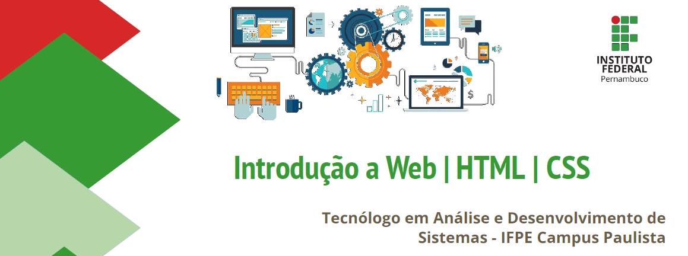

<h1 align="center">
  
</h1>

<h1 align="center">Web Systems Development I - 1st Unit</h1>

## Description

Project development for 1st unit the Web Systems I course at the Federal Institute of Pernambuco.

- Introduction to Internet Browsers: Current state of browser support for standards;
- HTML: Introduction, textual elements, lists, tables, forms, validation;
- CSS: Introduction, selectors and properties, specificity, importance, validation;

### 🛠 Technologies

The following tools were used in the construction of the project:

- [HTML](https://www.w3schools.com/html/)
- [CSS](https://www.w3schools.com/css/default.asp)
